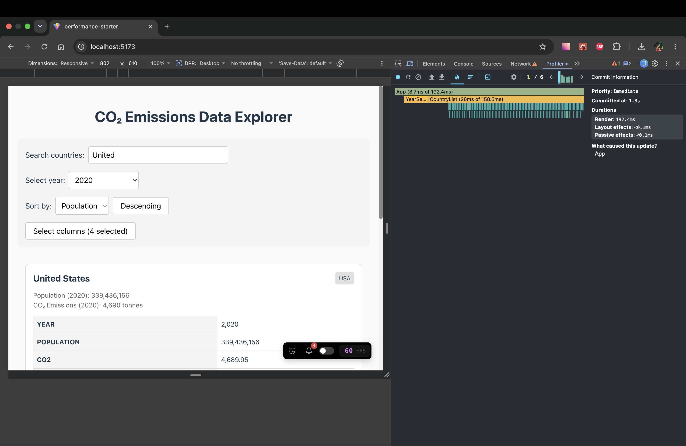
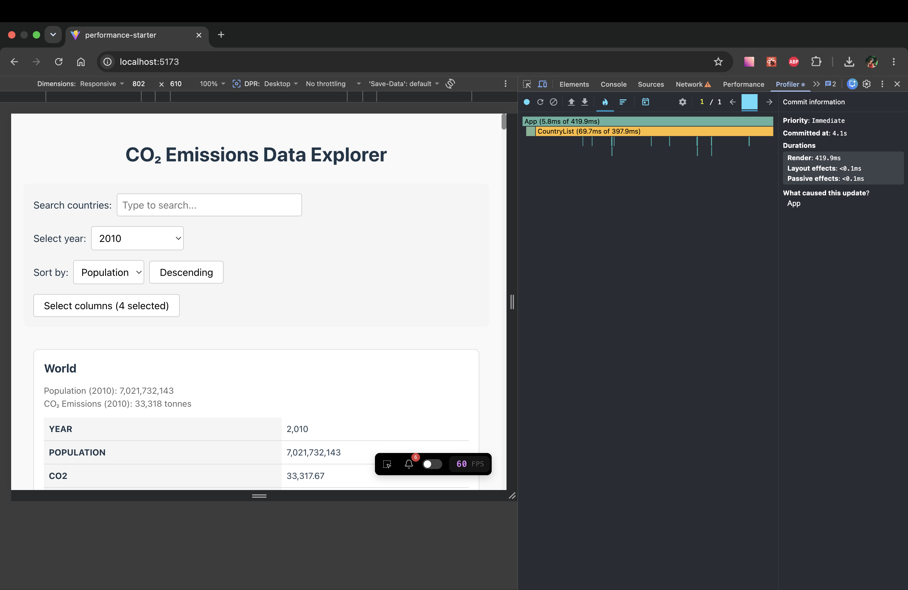
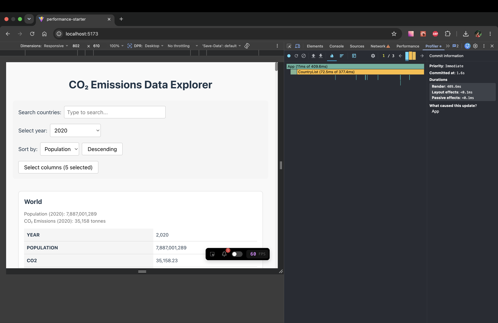

# Performance Optimization Report

## Baseline Measurements

### Interaction A: Sort countries

- **Commit duration**: <0.2 ms
- **Render duration**: 409.6 ms
- **Screenshot**: 

### Interaction B: Search countries

- **Commit duration**: <0.2 ms
- **Render duration**: 192.4 ms
- **Screenshot**: 

### Interaction C: Change year

- **Commit duration**: <0.2 ms
- **Render duration**: 419.9 ms
- **Screenshot**: 

### Interaction D: Toggle column

- **Commit duration**: <0.2 ms
- **Render duration**: 409.6 ms
- **Screenshot**: 
