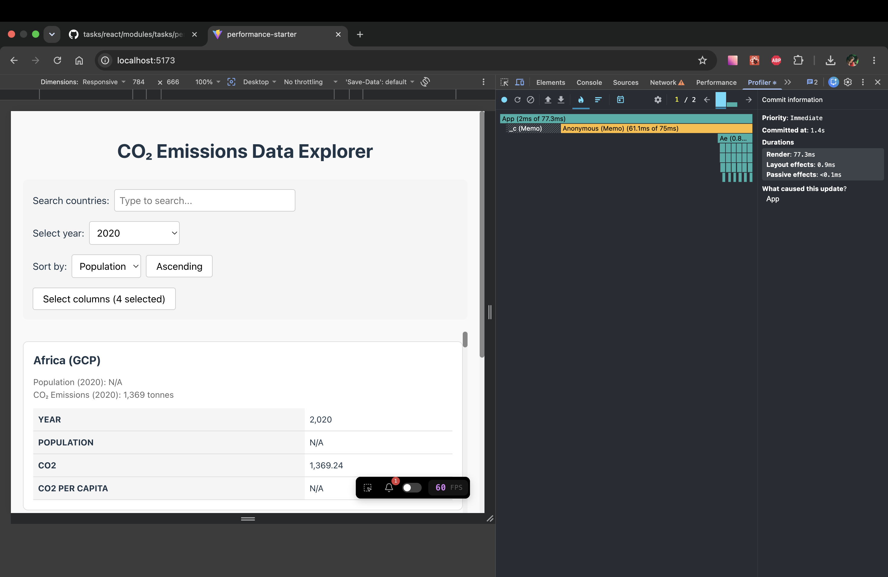
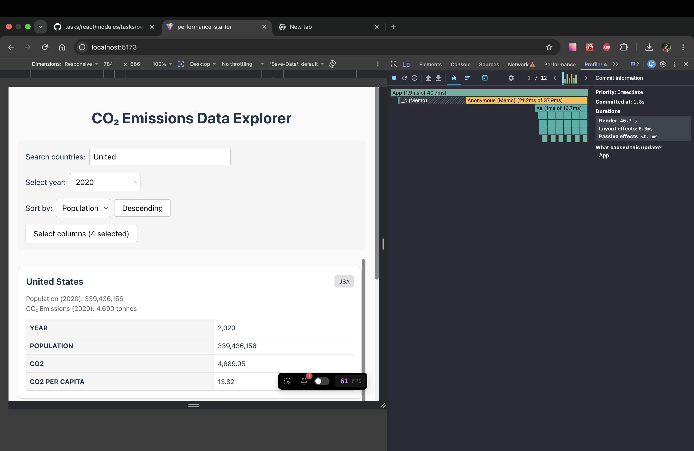
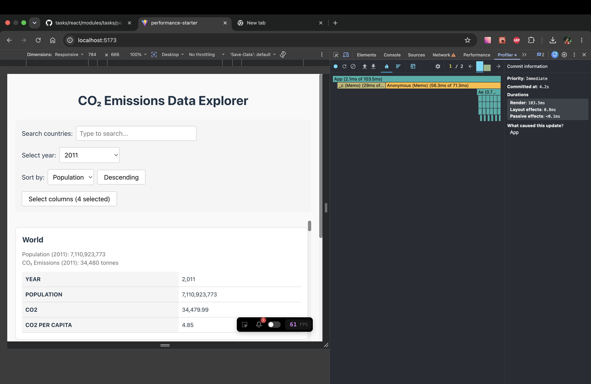
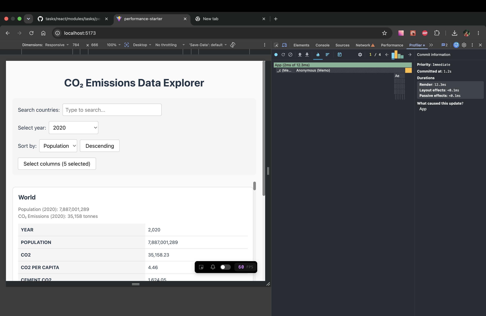

# Performance Optimization Report

## Baseline Measurements
- **Commit duration**: N/A — React DevTools Profiler does not show a separate commit phase duration. `Committed at` is a timestamp from the start of recording, not a duration. See the RSS Mentor clarification in [Discord](https://discord.com/channels/794806036506607647/1333748258098380820/1515111545905090610).

### Interaction A: Sort countries

- **Render duration**: 409.6 ms
- **Layout effects duration**: < 0.1 ms
- **Passive effects duration**: < 0.1 ms
- **Screenshot**: 

### Interaction B: Search countries

- **Render duration**: 192.4 ms
- **Layout effects duration**: < 0.1 ms
- **Passive effects duration**: < 0.1 ms
- **Screenshot**: 

### Interaction C: Change year

- **Render duration**: 419.9 ms
- **Layout effects duration**: < 0.1 ms
- **Passive effects duration**: < 0.1 ms
- **Screenshot**: 

### Interaction D: Toggle column

- **Render duration**: 409.6 ms
- **Layout effects duration**: < 0.1 ms
- **Passive effects duration**: < 0.1 ms
- **Screenshot**: 

## Optimized Measurements

### Interaction A: Sort countries

- **Render duration**: 77.3 ms
- **Layout effects duration**: 0.9 ms
- **Passive effects duration**: < 0.1 ms
- **Screenshot**: 

### Interaction B: Search countries

- **Render duration**: 40.7 ms
- **Layout effects duration**: 0.8 ms
- **Passive effects duration**: < 0.1 ms
- **Screenshot**: 

### Interaction C: Change year

- **Render duration**: 103.5 ms
- **Layout effects duration**: 0.8 ms
- **Passive effects duration**: < 0.1 ms
- **Screenshot**: 

### Interaction D: Toggle column

- **Render duration**: 12.3 ms
- **Layout effects duration**: < 0.1 ms
- **Passive effects duration**: < 0.1 ms
- **Screenshot**: 

## Summary of Improvements

| Interaction      | Baseline (ms) | Optimized (ms) | Improvement |
| ---------------- | ------------- | -------------- | ----------- |
| Sort countries   | 409.6         | 77.3           | 81.1%       |
| Search countries | 192.4         | 40.7           | 78.8%       |
| Change year      | 419.9         | 103.5          | 75.4%       |
| Toggle column    | 409.6         | 12.3           | 97.0%       |
| **Average**      | **357.9**     | **58.5**       | **83.7%**   |
